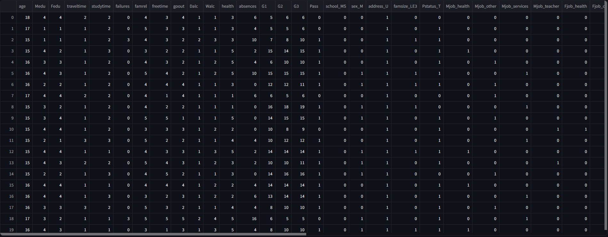
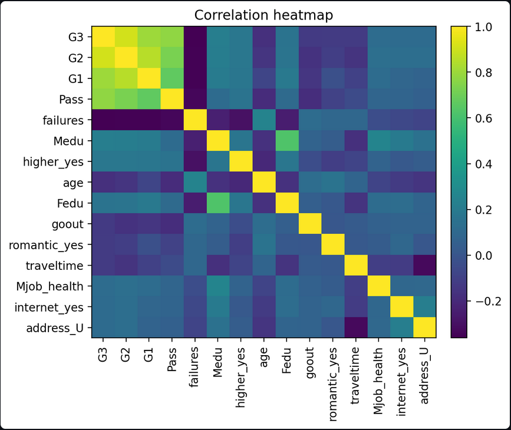
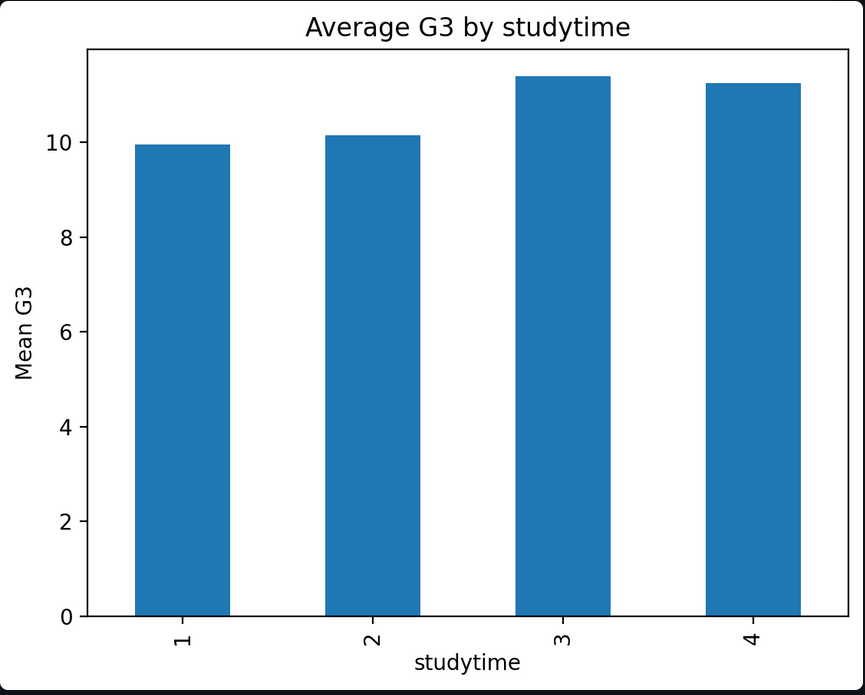
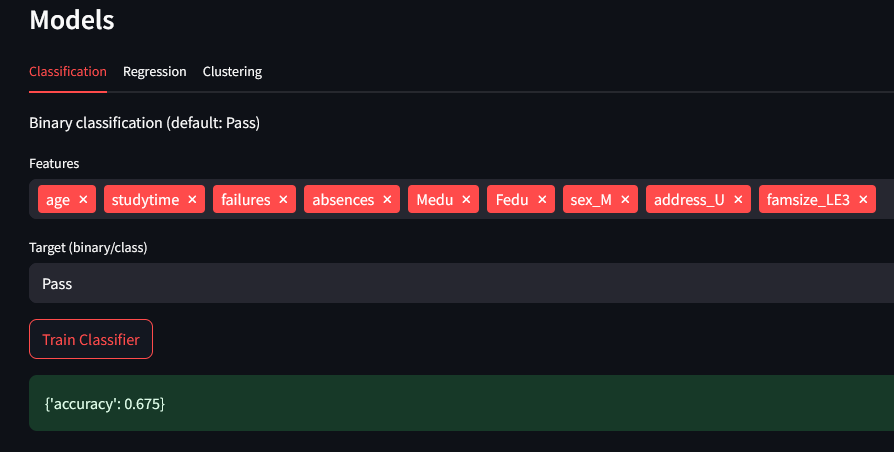
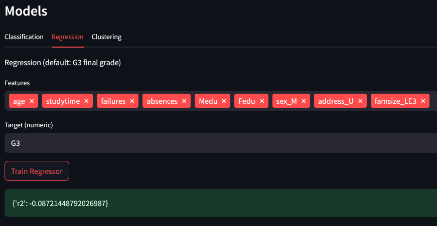
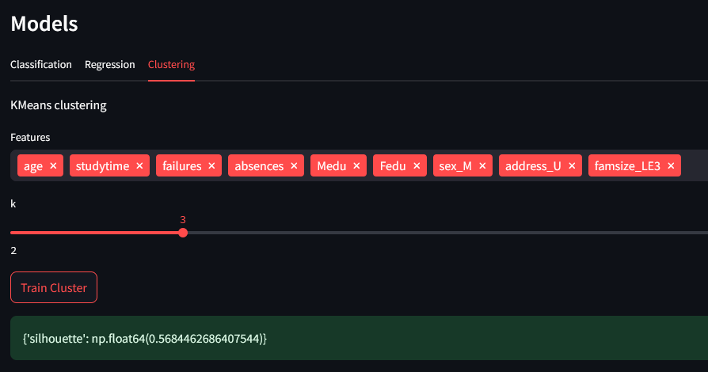

# Predicting Student Success with BI/AI

## Abstract
**Challenge:** Schools need early insight into which students are at risk of failing.  
**Why it matters:** Timely support can improve graduation rates and long-term outcomes.  
**Contribution:** We deliver an end-to-end BI/AI pipeline on the Student Performance (Maths) dataset: data ingestion & cleaning, visual analytics, predictive modelling, and an interactive Streamlit app.  
**Impact & users:** Teachers and administrators can monitor risk, understand drivers of performance, and plan targeted interventions.

---

## Sprints

### Sprint 1 — Problem Formulation
- **Context:** Predicting academic outcomes and understanding the factors behind them.  
- **Questions:**  
  1) Can we predict **Pass/Fail** reliably?  
  2) How well can we estimate **final grade (G3)**?  
  3) What **student profiles** emerge from clustering?  
- **Hypotheses:** More **studytime** → higher G3; more **failures/absences** → lower G3.  
- **Setup:** Streamlit app + Python pipeline in this repo.

### Sprint 2 — Data Preparation & EDA
- **Source:** Student Performance (Maths) (UCI/Kaggle). Placed at `data/raw/dataset.xlsx` (or `dataset.csv`).  
- **Processing:**  
  - Create binary **Pass = (G3 ≥ 10)**.  
  - One-hot encode categorical variables.  
  - Save model-ready table to `data/processed/dataset_clean.csv`.  
- **Evidence (screenshots):**  
  - Data preview  
      
  - Correlation heatmap (top features; G3 vs drivers)  
      
  - Average **G3** by **studytime**  
    
- **Insights:**  
  - Higher **studytime** associates with higher **G3**.  
  - More **failures** and **absences** associate with lower **G3**.

### Sprint 3 — Data Modelling
- **Classification:** Target = **Pass**; Features ≈ `age, studytime, failures, absences, Medu, Fedu, sex_M, address_U, famsize_LE3`.  
  - **Result:** Accuracy = **[0.675]**  
  - 
- **Regression:** Target = **G3** (numeric); Features same as above.  
  - **Result:** R² = **[-0.0872]**  
  - 
  - “The regression performed poorly (R² = -0.087), showing that our simple model could not predict grades accurately. This highlights dataset complexity and suggests feature engineering or alternative models are needed.”
- **Clustering:** KMeans, **k=3**; Features similar set (exclude targets).  
  - **Result:** Silhouette = **[0.568]**  
  - 
- **Interpretation:**  
  - Classification enables early risk flagging (Pass/Fail).  
  - Regression provides grade estimates for planning.  
  - Clustering reveals distinct study profiles for targeted support.

### Sprint 4 — Business Application
- **App:** `streamlit run app/streamlit_app.py`  
  - Pages show: dataset, quick plots, advanced EDA, and model training with metrics.  
- **Audience:** Non-technical staff can explore drivers and run simple “what-if” experiments by toggling features.  
- **Limitations:** Dataset is from one context; future work: fairness checks, feature importance, temporal validation.

---

## How to Run

```bash
python -m venv .venv
# Windows:
.venv\Scripts\activate
# macOS/Linux:
source .venv/bin/activate

pip install -r requirements.txt
streamlit run app/streamlit_app.py

## Repo Map
- `src/` — ingestion, EDA, models  
- `app/` — Streamlit app  
- `data/` — raw & processed data  
- `models/` — saved `.joblib` models  
- `assets/` — screenshots for README

## Credits
- Student Performance dataset (UCI/Kaggle)
- Coursework MP1–MP3 components reused and adapted